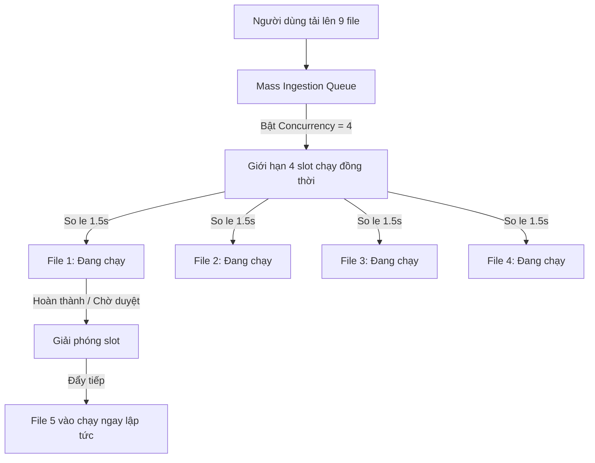
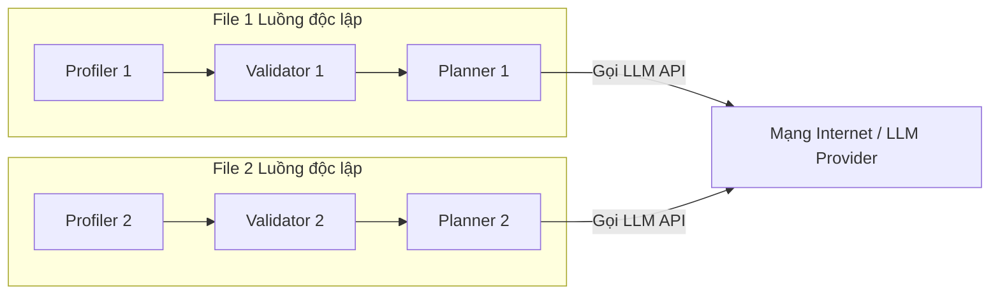

# Tổng Hợp Hệ Thống Hàng Đợi Song Song & Cải Tiến Giao Diện (Mass Ingestion Queue)

Tài liệu này tổng hợp toàn bộ các thay đổi mã nguồn, kiến trúc xử lý song song, các giải pháp cải tiến trải nghiệm người dùng (UX) và cơ chế vận hành của hệ thống hàng đợi làm sạch dữ liệu hàng loạt.

---

## 1. Kiến Trúc Xử Lý Song Song (Real Concurrency Pool)

Hệ thống triển khai xử lý song song thực sự (Real Concurrency) trên cả hai phía Frontend và Backend thay vì mô phỏng tuần tự:



### Phía Frontend (React Client)
* **Sliding Window Dispatcher**: Duy trì một hồ chứa (pool) tối đa $N$ công việc hoạt động (`uploading`, `running`, `resuming`).
* **Start Delay Debounce (1.5s)**: Gửi yêu cầu khởi chạy so le cách nhau 1.5 giây để tránh làm ngập (overwhelm) máy chủ khi tải lên nhiều file cùng lúc.
* **Concurrent Polling**: Sử dụng danh sách các bộ đếm thời gian độc lập (`pollIntervalsRef`) để truy vấn trạng thái của từng tệp tin từ máy chủ mà không làm nghẽn luồng xử lý chính.

### Phía Backend (FastAPI & LangGraph)
* **Asynchronous Background Tasks**: Endpoint `/pipeline/run` trả về mã `run_id` ngay lập tức và ném tác vụ xử lý đồ thị vào `FastAPI Background Tasks` chạy bất đồng bộ dưới nền.
* **State Isolation**: Mỗi tệp tin sở hữu một bản sao đồ thị (LangGraph instance) riêng biệt được quản lý qua `run_id` (thread_id) trong cơ sở dữ liệu Checkpointer.
* **Non-Blocking I/O**: Các tác vụ gọi LLM (chiếm phần lớn thời gian) được chạy bằng `async/await`. Khi tệp tin 1 đang đợi API LLM phản hồi, máy chủ sẽ tự động nhường CPU xử lý tệp tin 2.

---

## 2. Cơ Chế Hoạt Động Của Các Node Agent (Planner, Profiler, v.v.)

Một hiểu lầm phổ biến là chỉ có duy nhất "một" con Planner hay Profiler làm việc rồi nhảy qua nhảy lại giữa các file. Thực tế, hệ thống vận hành theo nguyên lý **nhân bản độc lập và xử lý đa nhiệm bất đồng bộ**:



* **Thực thể độc lập (Isolation)**: Mỗi tệp tin khi được gửi đi sẽ tạo ra một thực thể đồ thị LangGraph hoàn toàn mới trong bộ nhớ. Mỗi thực thể này chạy trên một tiến trình luồng (thread) riêng biệt dựa trên `run_id`.
* **Không chia sẻ trạng thái**: `Planner 1` của File 1 và `Planner 2` của File 2 là các tác vụ chạy song song, không chia sẻ biến và không biết đến sự tồn tại của nhau. Chúng gọi LLM API độc lập với các ngữ cảnh và nội dung prompt khác nhau.
* **Tận dụng thời gian chờ (Yielding Control)**: 
  * Khi `Planner 1` gọi LLM API thông qua hàm `await`, hệ thống sẽ tạm thời treo tiến trình của File 1 để đợi kết quả trả về từ internet.
  * Trong thời gian treo đó, CPU sẽ được giải phóng hoàn toàn để xử lý node `Profiler 2` hoặc `Planner 2` của File 2.
  * Khi có dữ liệu trả về từ LLM cho File 1, hệ thống sẽ đánh thức tiến trình của File 1 và chạy tiếp các node sau (`Deduplication`, `Null Handling`, v.v.).

---

## 3. Các Cải Tiến Trải Nghiệm Người Dùng (UX/UI)

Để khắc phục các vấn đề phát sinh khi xử lý đồng thời nhiều tệp tin, các logic sau đã được thiết kế và triển khai:

### A. Cơ Chế Hàng Đợi Duyệt Duy Nhất (Interactive HITL Queue)
* **Vấn đề**: Khi nhiều tệp chạy song song đồng thời chạm mốc cần duyệt (HITL), việc tự động chuyển đổi giao diện chi tiết ở khung phải sẽ ngắt quãng thao tác điền của người dùng.
* **Giải pháp**:
  * Sử dụng `queueRef` và `selectedInspectIdRef` để khóa màn hình chi tiết nếu người dùng đang tích cực làm việc với một tệp cần duyệt (`needs_clarification`).
  * Khi người dùng nhấn nút duyệt hoặc xóa tệp hiện tại, hệ thống tự động quét danh sách hàng đợi theo mô hình **FIFO (First-In-First-Out)** và tự động hướng tiêu điểm sang tệp tiếp theo cần chú ý.

### B. Làm Nổi Bật Dòng Cần Duyệt (Row Highlighting)
* **Giải pháp**: Các hàng có trạng thái `Action Required` (Chờ duyệt) sẽ được áp dụng bộ CSS đặc thù:
  * Nền vàng hổ phách nhạt: `bg-amber-50/50`
  * Viền trái màu cam đậm: `border-l-2 border-l-amber-500`
  * Giúp người dùng dễ dàng định vị các dòng đang bị kẹt để nhấp vào xử lý.

### C. Bản Địa Hóa Trực Quan Cho End-User (Copywriting & Card Design)
* **Vấn đề**: Khi dừng ở bước phê duyệt kế hoạch, thông báo cũ hiển thị lỗi kỹ thuật khó hiểu và nhãn nút không khớp hành động.
* **Giải pháp**:
  * **Thông báo động**:
    * Duyệt kế hoạch (Plan Approval): *"Kế hoạch làm sạch dữ liệu đã được tạo. Vui lòng xem và phê duyệt để tiến hành."*
    * Hoàn tất (Validation Review): *"Đã hoàn tất dọn dẹp. Vui lòng xem kết quả kiểm định để lưu lại."*
  * **Nút bấm động**:
    * Duyệt kế hoạch $\rightarrow$ **`Approve Plan & Start Cleaning`**
    * Hoàn tất $\rightarrow$ **`Accept Results & Finalize`**
  * **Trực quan hóa kế hoạch bằng Thẻ (Task Cards)**: Thay thế khối văn bản thô bằng danh sách thẻ công việc chi tiết. Mỗi thẻ hiển thị:
    * Trạng thái cụ thể (`Active` / `Skipped`).
    * Các cột bị tác động (vẽ dạng nhãn code-monospaced).
    * Lý do chi tiết hoặc lý do bỏ qua của tác vụ đó.

---

## 4. Nhật Ký Mã Nguồn Thay Đổi (Code Diff Summary)

### Loại bỏ biến dư thừa và sửa lỗi biên dịch (MassUploadView.tsx)
```diff
-  const removeRow = (id: string, idx: number) => {
+  const removeRow = (id: string) => {
...
-                                    removeRow(item.id, idx);
+                                    removeRow(item.id);
```

### Logic chống cướp tiêu điểm và Tự động chuyển hàng đợi duyệt
```typescript
// Trong hàm startPolling:
const currentQueue = queueRef.current;
const currentSelectedId = selectedInspectIdRef.current;
const currentlyInspectedItem = currentQueue.find((q) => q.id === currentSelectedId);
const isUserBusyWithClarification = currentlyInspectedItem && currentlyInspectedItem.status === "needs_clarification";

if (!isUserBusyWithClarification) {
  setSelectedInspectId(itemId);
}
```

```typescript
// Trong hàm handleResolveClarification khi phê duyệt thành công:
const nextNeedsClarification = queue.find(
  (item) => item.id !== activeItem.id && item.status === "needs_clarification"
);
if (nextNeedsClarification) {
  setSelectedInspectId(nextNeedsClarification.id);
}
```
